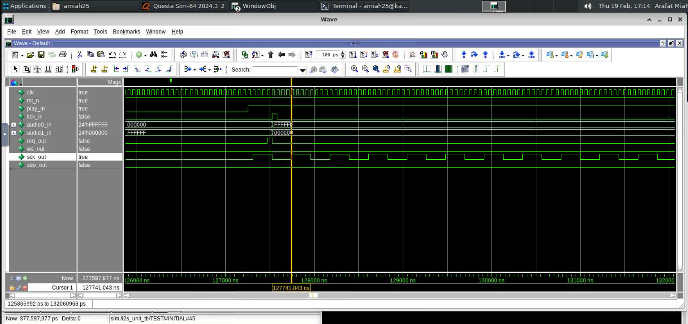
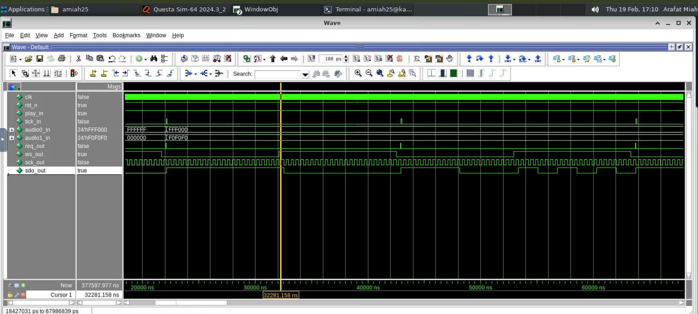

# RTL I²S Unit Design (Lab 06)

## Repository
**Recommended name:** `Digital-Technique-3_Lab-06-RTL-I2S-Unit-Design`

## Overview
This repository contains the RTL implementation of an **I²S (Inter-IC Sound) transmitter unit** developed for **Digital Technique 3 – Lab 06**.  
The design converts two parallel **24-bit audio samples** (`audio0_in`, `audio1_in`) into standard I²S outputs:
- `sck_out` — Serial Clock (SCK)
- `ws_out` — Word Select / Left–Right Clock (WS)
- `sdo_out` — Serial Data Output (SDO)  
A handshake signal is also generated:
- `req_out` — request for the next stereo sample

## Files Included
- `i2s_unit.vhd` — RTL implementation of the I²S unit
- `fig_6_1_play_enable_i2s_start.png` — simulation evidence for play enable and I²S start
- `fig_6_2_sck_ws_sdo_timing.png` — simulation evidence for SCK/WS/SDO timing relationship
- `fig_6_3_req_out_end_of_frame.png` — simulation evidence for end-of-frame `req_out` pulse

---

## 6.1 Initial RTL Architecture Specification (Summary)
The initial architecture was designed by dividing the system into two interacting parts:

### 1) Timing/Control
- A play/standby control register enables/disables I²S activity.
- A single frame counter acts as the global time base.
- Combinational decoding of the counter generates `sck_out`, `ws_out`, shift/load events, and a one-cycle `req_out` pulse.

### 2) Data Path
- A **48-bit input register** captures `{audio0_in, audio1_in}` when `tick_in` is asserted in play mode.
- A **48-bit shift register** serializes the stereo sample and drives `sdo_out` MSB-first.
- Shifting is aligned to a safe internal event derived from the counter timing (aligned to the falling edge of `sck_out`).

**Figure 6.1 — Play mode enabled and I²S activity starts**  

**Figure 6.2 — Relationship between SCK, WS, and SDO shifting**  

**Figure 6.3 — End-of-frame request pulse (`req_out`)**  

---

## 6.2 Refined Architecture Specification (Observations and Learning)
### What I observed
- Generating `sck_out` and `ws_out` from a **single counter** keeps the timing consistent and easy to verify.
- The serial data (`sdo_out`) is stable when shifting occurs only on a defined internal event aligned with the I²S clock.
- A one-cycle `req_out` at the **end of each 48-bit frame** provides a simple and deterministic request mechanism for the next stereo sample.

### What I learned
- Practical understanding of **I²S timing**, including clocking and left/right channel separation using `ws_out`.
- How **input buffering + shift-register serialization** produces a correct serial audio stream.
- Clear separation of **sequential resources (registers/counter)** and **combinational decode logic** improves debugability and correctness.

---

## Notes
When I got stuck, I used AI as a guidance tool to clarify concepts and validate my approach; however, the RTL code and report content were written by me.

## Author
Arafat Miah
